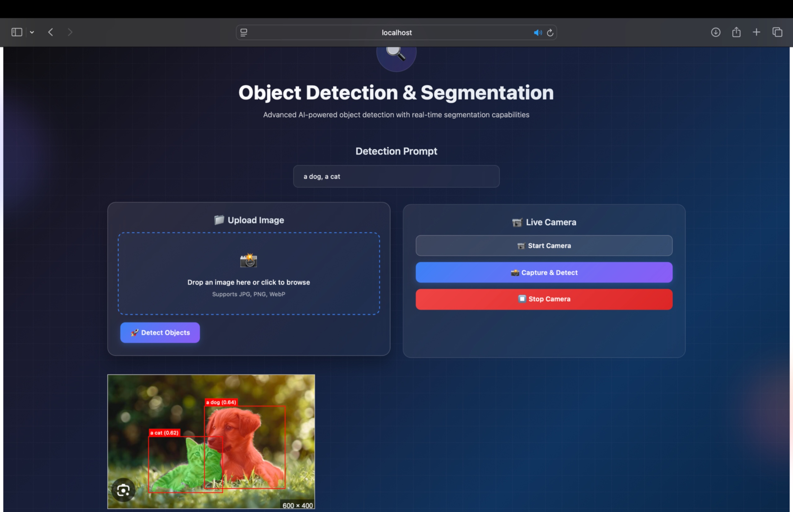
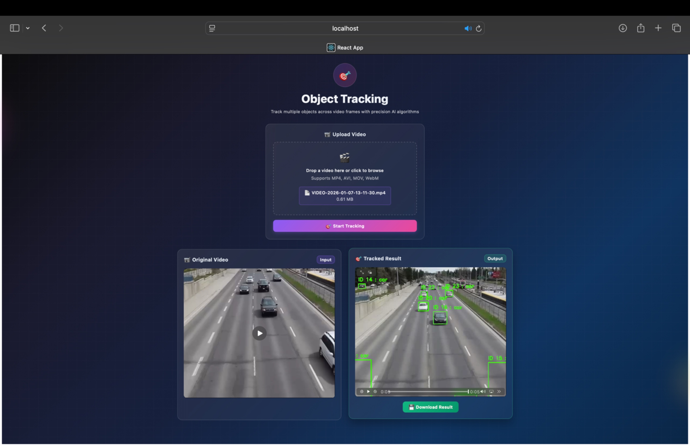
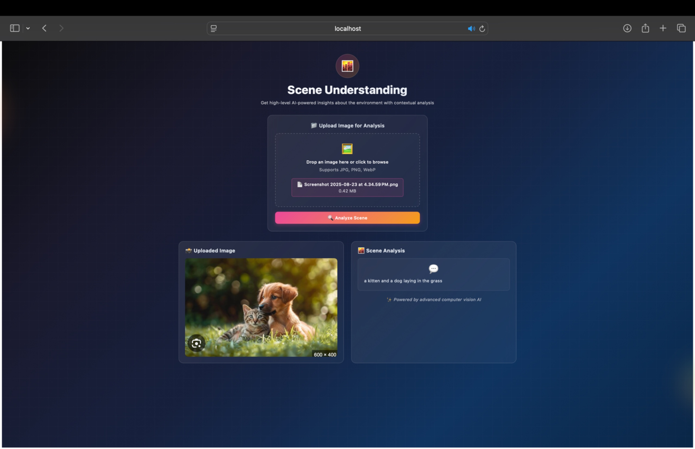
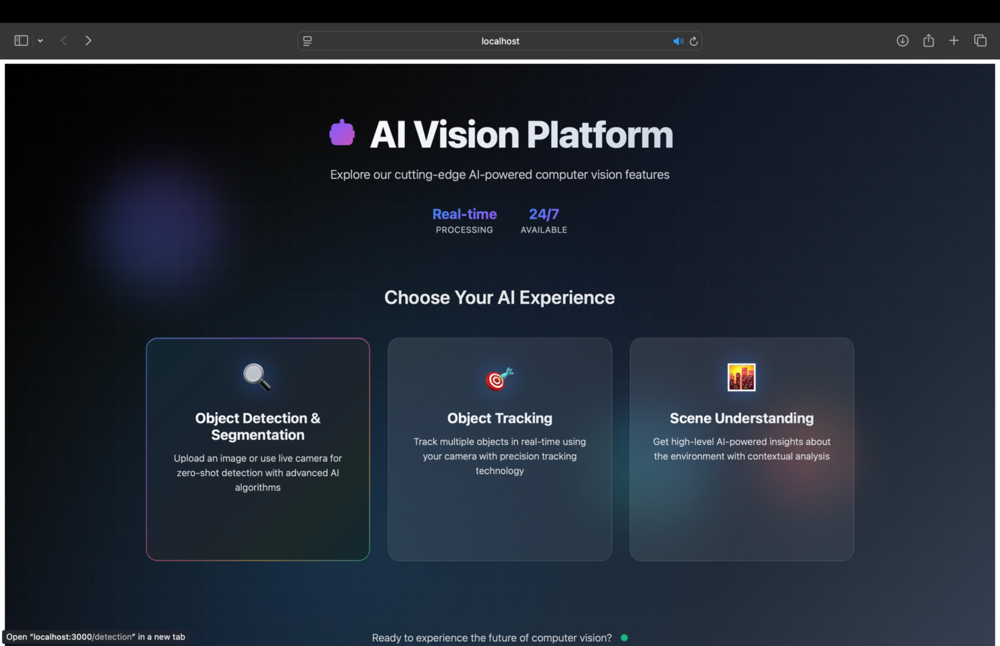

# 🧠 AI Vision Platform

An AI-powered computer vision web platform that enables **zero-shot object detection**, **segmentation**, **multi-object tracking**, and **scene understanding** through an interactive web interface.

The system integrates state-of-the-art AI models with a **React frontend** and **Python backend** to provide real-time visual intelligence.

## 🚀 Features

### 🔍 Object Detection & Segmentation
- Zero-shot object detection using **GroundingDINO**
- Instance segmentation using **Segment Anything Model (SAM)**
- Detect objects without custom training
- **Supported inputs:**
  - Image Upload
  - Live Camera Detection
  - Text Prompt Detection
- **Example prompt:** `a dog, a cat`

### 🎯 Object Tracking
- Multi-object tracking using:
  - **YOLOv8** → object detection
  - **DeepSORT** → tracking across frames
- **Capabilities:**
  - Upload video
  - Track multiple objects
  - Assign unique IDs
  - Download processed tracking result
- **Supported formats:** MP4, AVI, MOV, WEBM

### 🧠 Scene Understanding
- Scene understanding using **BLIP Vision-Language Model**
- **Capabilities:**
  - Image captioning
  - Context-aware scene description
  - High-level semantic understanding
- **Example output:** `a kitten and a dog laying in the grass`

## 📸 Application Interface

| Module | Description | Demo |
|--------|-------------|------|
| 🏠 **Home Dashboard** | Choose between three AI modules |  |
| 🔍 **Object Detection** | Real-time detection with text prompts |  |
| 🎯 **Object Tracking** | Video upload & multi-object tracking |  |
| 🧠 **Scene Understanding** | AI-powered scene descriptions |  |

## 🏗️ System Architecture
Frontend (React)
│
│ REST API
▼
Backend (Python)
│
├── GroundingDINO + SAM
│ → Zero-shot detection & segmentation
│
├── YOLOv8 + DeepSORT
│ → Multi-object tracking
│
└── BLIP Model
→ Scene understanding

## 📂 Project Structure
zsod-webapp/
│
├── backend/
│ ├── app.py
│ ├── models/
│ ├── routes/
│ └── utils/
│
├── frontend/
│ ├── public/
│ ├── src/
│ │ ├── components/
│ │ ├── pages/
│ │ └── App.js
│ └── package.json
│
├── docs/
│ └── images/
│ ├── home.png
│ ├── detection.png
│ ├── tracking.png
│ └── scene.png
│
├── requirements.txt
└── README.md

text

## ⚙️ Installation & Setup
### 1️⃣ Clone Repository
git clone https://github.com/SatthuSaiPranavi/ZeroShot-Object-Detection-.git
cd ZeroShot-Object-Detection-

Backend Setup

Create virtual environment:

python -m venv venv

Activate environment:

Windows:

venv\Scripts\activate

Install dependencies:

pip install -r requirements.txt

Run backend:

python app.py

Backend runs on:

http://localhost:5000
Frontend Setup

Navigate to frontend:

cd frontend

Install dependencies:

npm install

Run development server:

npm start

Open in browser:

http://localhost:3000

3000
📦 Available Scripts (React)

In the frontend directory:

Start Development Server
npm start

Runs the app in development mode.

Open:

http://localhost:3000
Run Tests
npm test
Build Production Version
npm run build

Builds the app into the build folder for deployment.

Eject Configuration
npm run eject

⚠️ One-way operation.

Copies build configuration files into the project for full customization.

.

🧠 AI Models Used
| Model         | Purpose                       |
| ------------- | ----------------------------- |
| GroundingDINO | Zero-shot object detection    |
| SAM           | Instance segmentation         |
| YOLOv8        | Object detection for tracking |
| DeepSORT      | Multi-object tracking         |
| BLIP          | Scene understanding           |

🎯 Applications

Autonomous driving research

Smart surveillance systems

Robotics perception

Video analytics

Scene understanding systems

📌 Future Improvements

Real-time video tracking

Cloud deployment

Model optimization

Interactive segmentation tools

Edge device support

👩‍💻 Author

Sai Pranavi Reddy

AI / Machine Learning Engineer
Computer Vision • Deep Learning • Full Stack AI Systems

